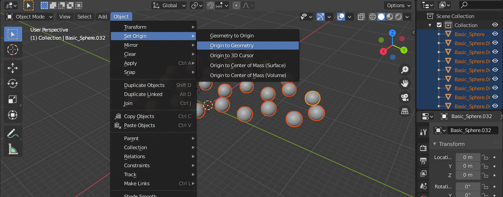
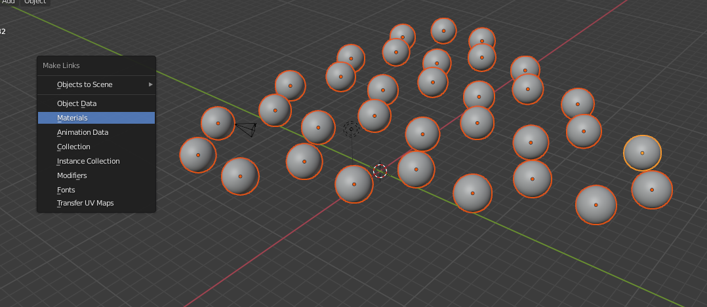
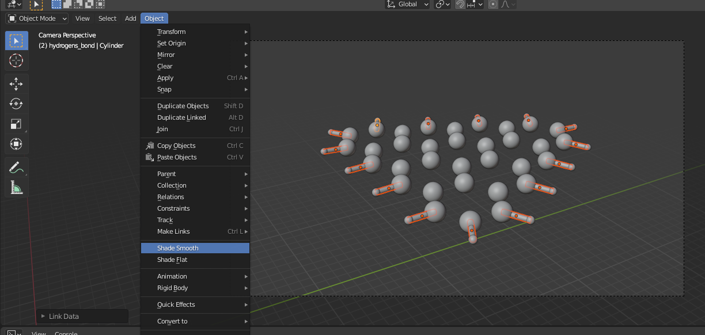
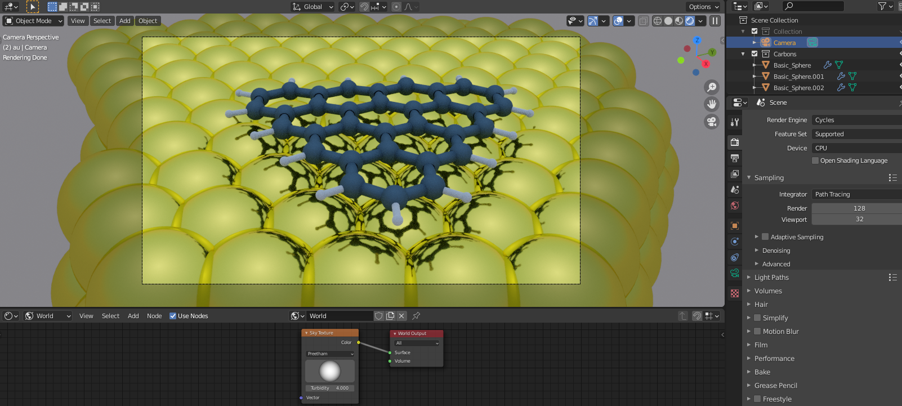

# Blender Atomic Loader

This is a simple library that allows to load atomic data into blender using ASE and draw spheres for atoms and cylinders for bonds. This README is meant to show how to use Blender to render a simple PDB or XYZ (or anything supported by ASE). 

The functions in here are pretty simple and most of them are meant for 2D systems made by a metal substrate with a molecule on top. However, this is just an example and can easily be extend to work with other systems.

**The following guide has been tested with Blender 2.90**

## Installing the library

Blender comes with a internal python environment, where the library and it's dependencies (such as `ase`) need to be installed.

A simple way to do this is the following:

1) run Blender with elevated privileges (run as administrator/sudo);
2) open a "Text Editor" (`Shift F11`) and create an empty script (`+ New`)
3) Copy and paste the following in the editor (select either Option 1 or 2 by commenting/uncommenting):
```python
import subprocess
import sys
import os

# path to python.exe
python_exe = os.path.join(sys.prefix, 'bin', 'python.exe')

# install and upgrade pip
subprocess.call([python_exe, "-m", "ensurepip"])
subprocess.call([python_exe, "-m", "pip", "install", "--upgrade", "pip"])

# Option 1: install directly from github
subprocess.call([python_exe, "-m", "pip", "install", "git+https://github.com/nanotech-empa/blender-atomic-loader.git#egg=blender-atomic-loader"])

# Option 2 (developers): install from local source (e.g. from a git clone)
#subprocess.call([python_exe, "-m", "pip", "install", "-e", "path/to/blender-atomic-loader"])
```
4) Run the script (button with an arrow/`Alt P`) and wait
5) To confirm that the library is available, open the internal python console (`Shift F4`) and try `import ase`, `import blender_atomic_loader`. Restarting Blender might be needed.


## Importing `blender_atomic_loader` from Blender

Clone or download this repository and open Blender. The library can be loaded using `importlib`:

```python
import importlib.util
 
spec = importlib.util.spec_from_file_location("blender_atomic_loader", "$PATH_TO_Blender_atomic_loader/blender_atomic_loader.py")
bloader = importlib.util.module_from_spec(spec)
spec.loader.exec_module(bloader)
```

Simply copy and paste the lines above in your Blender's python console (changing the correct to the git folder) and you will be able to use the functions need to parse atomic structures and draw the corresponding objects from the command line. N.B: always use `bloader.` before the function's name:


```python
# Import ASE and Numpy
from ase.io import read
import numpy as np

# Read an example system
frame=read('example.pdb')

# Extract the molecule and discard the substrate
molecule=bloader.get_molecule(frame)
```

## Example usage

Follow this simple example to render an image of a triangulene molecule on gold (C33H240Au896.xyz).

Load the xyz:

```python
# Import libraries
from ase.io import read
import numpy as np

import blender_atomic_loader as bloader

# Read an example system
frame=read('C33H240Au896.xyz')
```

Get the molecule and create the spheres corresponding to the carbon atoms:

```python
# Extract the molecule only
molecule=bloader.get_molecule(frame)

# Draw only the carbons with the desired radious
bloader.draw_type(molecule,'C',0.2)
```

It is recommeded to set the origin at the object's centre (`Object > Set Origin > Origin to Geometry`):



It is also recommended to group all the atoms of the same specie under a new collection:


Now we can add a new material:

* select an atom
* add the desired material
* select all the carbon atoms (`Right click on the collection > Select objects`) paying attention that the active atom is the one for which we added the material (the active atom should be in yellow, the others selcted atoms will be orange)
* `CTRL-L > Make Links > Materials`:



The same can be done for hydrogens, using a smaller radious (0.08 in this example) and a different material.

If all the spheres corresponding the molecule atoms have been added, we can move on and draw the bonds. We can use the function `split_bonds()` to distinguish between bonds involving hydrogens or not:

```python
# Get the bonds and split those involving hydrogens
# An optional argument is the cutoff length (Defauls=1.5 Angstrom) 
b_hydr,b_backb=bloader.split_bonds(molecule)
```

In this way we can have some contro on the style of different bonds. Let's draw the bonds involving H atoms:

```python
# Loop through each bond pair
for bond in b_hydr:
    # we need to pass to the function the coordinates of the two ends and the radious
    baloader.cylinder_between(molecule[bond[0]].position,molecule[bond[1]].position,0.11)
```

As before, on should group the bonds into a collection and the material. In this example I use the same material as for hydrogen spheres.

Also is important to smooth the surface through `Object > Shade Smooth`:



Again, the same can be done for Carbons, changing the cylinder radious (0.2 in this example) and the material.

Finally we can add the substrate drawing also gold atoms and then we can render the image. Here I am useing Cycle Render and HDRI lighting:



## Possible issues

When rendering from a laptop it can happen that the memory is not enough to render the image. The first suggestion is to remove all the atoms not visble from the camera view and the second is to render the image from the command line, without using the GUI (even better if you ssh to a larger machine with blender installed!):

```bash
blender -b test.blend -o output_name -f 1
```
