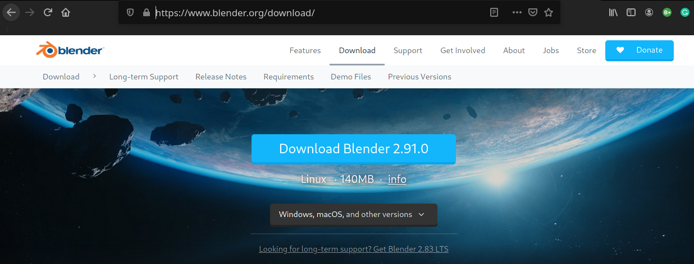

# Blender Atomic Loader

This is a simple library that allows to load atomic data into blender using ASE and draw spheres for atoms and cylinders for bonds. This README is meant to show how to use Blender to render a simple PDB or XYZ (or anything supported by ASE). 

The functions in here are pretty simple and most of them are meant for 2D systems made by a metal substrate with a molecule on top. However, this is just an example and can easily be extend to work with other systems.

**The following guide has been tested with Blender 2.90 and above. It should work for Blender 2.83 as well.**

## Downloading Blender

We suggest to download the last Blender version directly from the official [Blender download page](https://www.blender.org/download/).



## Installing the library

Blender comes with a internal python environment, where the library and it's dependencies (such as `ase`) need to be installed.

A simple way to do this is the following:

1) Only for Windows users: run Blender **with elevated privileges** (run as administrator);
2) open a "Text Editor" (`Shift F11`) and create an empty script (`+ New`)
3) Copy and paste the following in the editor (select either Option 1 or 2 by commenting/uncommenting):

```python
import subprocess
import sys
import os

# Get the pathe to the python executable
# For Linux users this will only work when downloading Blender directly from the official website. 
exe_name = [string for string in os.listdir(sys.prefix+'/bin/') if 'python' in string][0]
python_exe = os.path.join(sys.prefix, 'bin', exe_name)


# install and upgrade pip
subprocess.call([python_exe, "-m", "ensurepip"])
subprocess.call([python_exe, "-m", "pip", "install", "--upgrade", "pip"])

# Option 1: install directly from github
subprocess.call([python_exe, "-m", "pip", "install", "git+https://github.com/nanotech-empa/blender-atomic-loader.git#egg=blender-atomic-loader"])

# Option 2 (developers): install from local source (e.g. from a git clone)
#subprocess.call([python_exe, "-m", "pip", "install", "-e", "path/to/blender-atomic-loader"])
```
4) Run the script (button with an arrow/`Alt P`) and wait
5) To confirm that the library is available, open the internal python console (`Shift F4`) and try `import ase`, `import blender_atomic_loader`. Restarting Blender might be needed.


## Example usage

Follow this simple example to render an image of a triangulene molecule on gold (C33H240Au896.xyz).

Load the xyz:

```python
# Import libraries
from ase.io import read
import numpy as np

import blender_atomic_loader as bl

# Read an example system
frame=read('C33H240Au896.xyz')
```

Get the molecule and draw it:

```python
# Extract the molecule only
molecule=bl.get_molecule(frame)

# Draw the molecule 
bl.draw_molecule(molecule,'C')
```

Add the substrate by drawing gold atoms:

```python
# Draw only Gold atoms 
bl.draw_atoms(frame,'Au')
```

Finally, adjust the camera view and the lighting. To render the image press ('F12'). 
Here an example using Cycle Render and HDRI lighting:


A few things to note:

* it is recommended to group atoms of the same type under a new collection. Do this select a group of atoms, type (`m`) and click on (`+ New Collection`)
* by default we use the CPK colour scheme combined with a standard reflective material. One can manually change or add new materials. An intersting add-on with loads of cool materials is [the materials VX library](https://www.youtube.com/watch?v=EHq39AmRU3Q)
* if you add a new material and assign it to a specific object you can propagate the to other objects by selecting the target objects and then `CTRL-L > Make Links > Materials`.

## Possible issues

When rendering from a laptop it can happen that the memory is not enough to render the image. The first suggestion is to remove all the atoms not visble from the camera view and the second is to render the image from the command line, without using the GUI (even better if you ssh to a larger machine with blender installed!):

```bash
blender -b test.blend -o output_name -f 1
```
